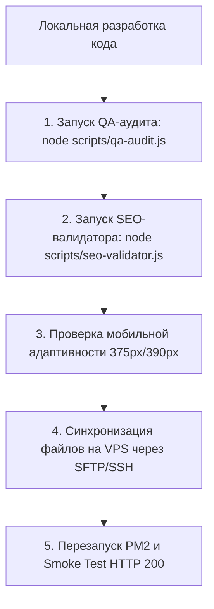

# ⚖️ ЮГ-ПРАВО LegalTech — Регламент администрирования и эксплуатации системы

Этот документ является **Обязательным операционным регламентом (SOP)** для AI-агента Antigravity и субагентов при администрировании, обновлении, деплое и поддержке веб-платформы и бот-экосистемы **АНО «ЦПЗ ЮГ-ПРАВО»**.

---

## 🧭 1. Паспорт инфраструктуры и топология

| Параметр | Значение |
|---|---|
| **Официальный домен** | `yugpravo.ru` (зеркало: `www.yugpravo.ru`) |
| **Резервный кириллический домен** | `юг-право.рф` (301-редирект на `yugpravo.ru`) |
| **Боевой сервер (VPS)** | Beget (Санкт-Петербург, РФ), IP: `82.202.129.126` |
| **ОС и Стек** | Ubuntu 24.04 LTS, Nginx 1.28.3, Node.js 20 LTS, PM2 Cluster, Let's Encrypt |
| **Рабочая директория на сервере** | `/var/www/yug-pravo` |
| **Конфигурация Nginx** | `/etc/nginx/sites-available/yug-pravo.conf` |
| **Конфиг автозапуска демонов** | `/var/www/yug-pravo/ecosystem.config.js` |
| **Секреты и токены** | `/var/www/yug-pravo/bots/.env` (НЕ коммитится в Git!) |

---

## 🤖 2. Реестр активных процессов PM2

При выполнении любых команд на сервере проверять статус 6 процессов:
1. `yug-pravo-web` (ID 0) — Веб-сервер и API (`server.js`, порт 8080)
2. `bot-main-ugpravo` (ID 1) — Главный бот правовой защиты (`@ugpravo_assistant_bot`)
3. `bot-jkh-audit` (ID 2) — Бот аудита и калькуляторов ЖКХ (`@ugpravo_help_bot`)
4. `bot-lapa-charity` (ID 3) — Бот программы помощи животным («Добрая лапа», `@Samara_promo_bot`)
5. `bot-info-repost` (ID 4) — Бот автопостинга новостей в канал (`@repostchilli_bot`)
6. `bot-vk-community` (ID 5) — Бот сообщества ВКонтакте (ID: `112146607`)

---

## 🔄 3. Железный протокол внесения изменений (Deployment Pipeline)

Перед отправкой любого обновления на продакшен-сервер Агент **ОБЯЗАН** выполнить строгий 5-ступенчатый чек-лист:

### Команды валидации:
1. `node scripts/qa-audit.js` — проверка всех HTML файлов на битые ссылки, мета-теги, W3C валидность и скрипты.
2. `node scripts/seo-validator.js` — проверка robots.txt, sitemap.xml и Schema.org разметки.
3. `node scripts/legal-validator.js` — самотестирование юридических калькуляторов (ст. 333.19 НК РФ, ГПК РФ).

---

## 🔒 4. Безопасность и защита персональных данных (152-ФЗ)

1. **Режим Standby (Техническое обслуживание):**
   - Если эквайринг или прием обращений находится на настройке — флаги в `js/forms.js`, `js/payment.js` и `server.js` должны возвращать вежливое уведомление о техработах (`maintenance: true`).
2. **Изоляция секретов:**
   - Ни при каких обстоятельствах не публиковать токены Telegram/VK, пароли БД или SSH-ключи в открытые репозитории.
3. **Хранение данных:**
   - Все файлы и персданные заявителей обрабатываются строго на серверах внутри РФ (п. 5 ст. 18 ФЗ № 152-ФЗ).
4. **Обязательные реквизиты в формах:**
   - Под каждой формой на сайте обязателен чекбокс согласия на обработку ПД со ссылкой на `privacy.html`.

---

## 🎨 5. Стандарты фронтенда и мобильной верстки

1. **Мобильные брейкпоинты:**
   - Тестирование верстки на экранах: **375px** (iPhone SE), **390px** (iPhone 13/14), **414px**, **768px** (iPad), **1280px+**.
2. **Нулевой горизонтальный скролл:**
   - Запрещен `overflow-x: scroll` на `body`. Проверка: `document.documentElement.scrollWidth <= window.innerWidth`.
3. **Плавные переходы:**
   - Использование View Transitions API и аппаратного GPU-ускорения (`transform`, `opacity`).
4. **Иконки:**
   - Использование чистых inline SVG из дизайн-системы Lex Renaissance через `scripts/icons.js`.

---

## 📄 6. Протокол публикации новых статей и событий

При добавлении новой новости / судебной практики / отчета:
1. Добавить карточку события в `events.html` или `knowledge.html` с семантической микроразметкой JSON-LD (`@type: "NewsArticle"` / `"LegalService"`).
2. Сжать изображения в формат `.webp` с разрешением не более 1600px.
3. Обновить дату последнего изменения в `sitemap.xml`.
4. При необходимости запустить автопостинг анонса в Telegram и VK через `node bots/autopost.js`.

---

## 🚨 7. Экстренный регламент (Disaster Recovery)

Если сайт или боты не отвечают:
1. **Проверить статус демонов:** `ssh root@82.202.129.126 "pm2 status"`
2. **Посмотреть свежие логи ошибок:** `ssh root@82.202.129.126 "pm2 logs --lines 50 --err"`
3. **Перезапустить веб-сервер и ботов:** `ssh root@82.202.129.126 "pm2 restart all"`
4. **Проверить Nginx:** `ssh root@82.202.129.126 "nginx -t && systemctl reload nginx"`
5. **Проверить сертификат SSL:** `ssh root@82.202.129.126 "certbot renew --dry-run"`

---

*Настоящий регламент утвержден для АНО «ЦПЗ ЮГ-ПРАВО» и является обязательным для исполнения при любом взаимодействии с проектом.*
